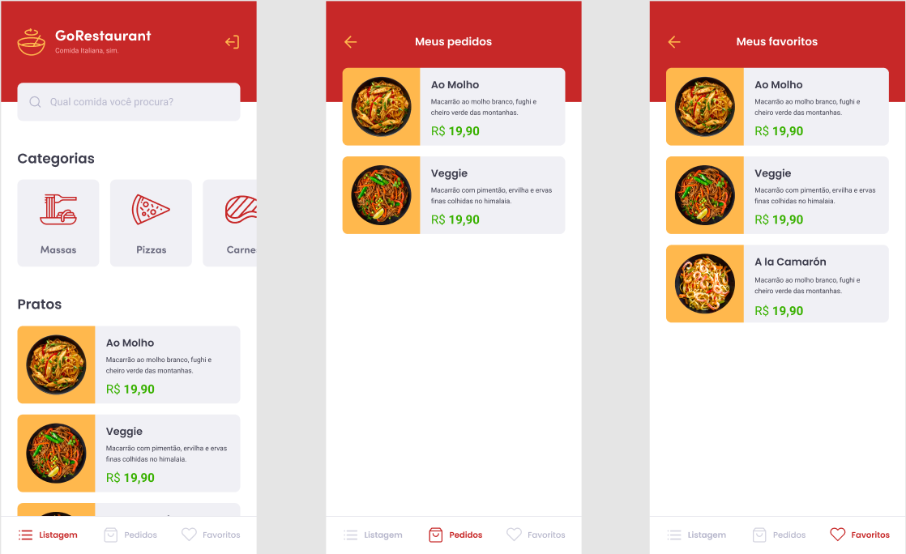

<h1 align="center">Welcome to GoRestaurant Mobile :ramen:</h1>
<p>
  
  <a href="#" target="_blank">
    
  </a>
</p>

> A restaurant management application to check dishes availability. This application was developed as a challenge of the Rocketseat Gostack BootCamp.

## Preview

 
 
## Others repositories of this project :books:
* <a href="https://github.com/lscborges1/GoRestaurant-Web">Web Front-end</a>


## Technologies Used

* <a href="https://reactnative.dev//">React Native ⚛️</a>
* <a href="https://styled-components.com/">Styled-Components 💅🏻</a>
* <a href="https://jestjs.io/">Jest 🃏</a>
* <a href="https://www.typescriptlang.org/">Typescript :blue_book:</a>

## Install

```sh
yarn install
```

## Usage

```sh
yarn android
```

or 

```sh
yarn ios
```

## Run tests

```sh
yarn run test
```

## Author

👤 **Lucas Borges**

* Github: [@lscborges1](https://github.com/lscborges1)

## Show your support

Give a ⭐️ if this project helped you!
